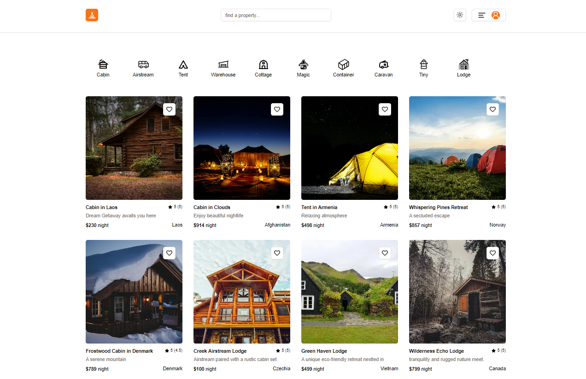
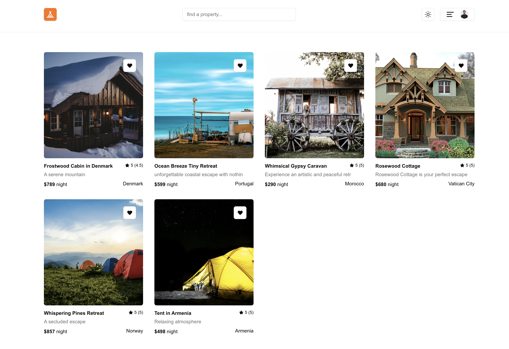
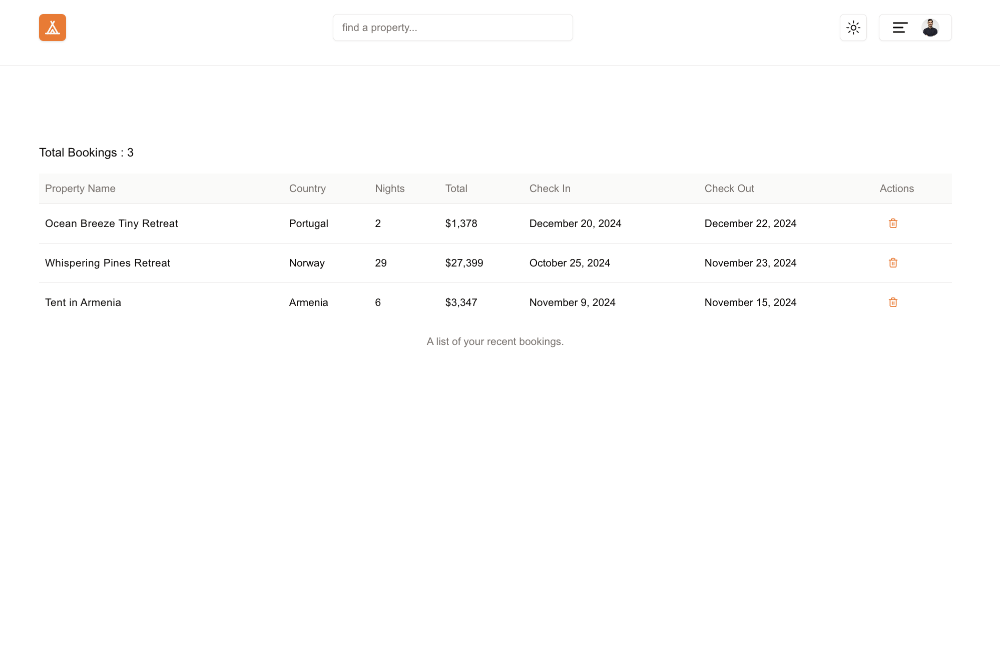
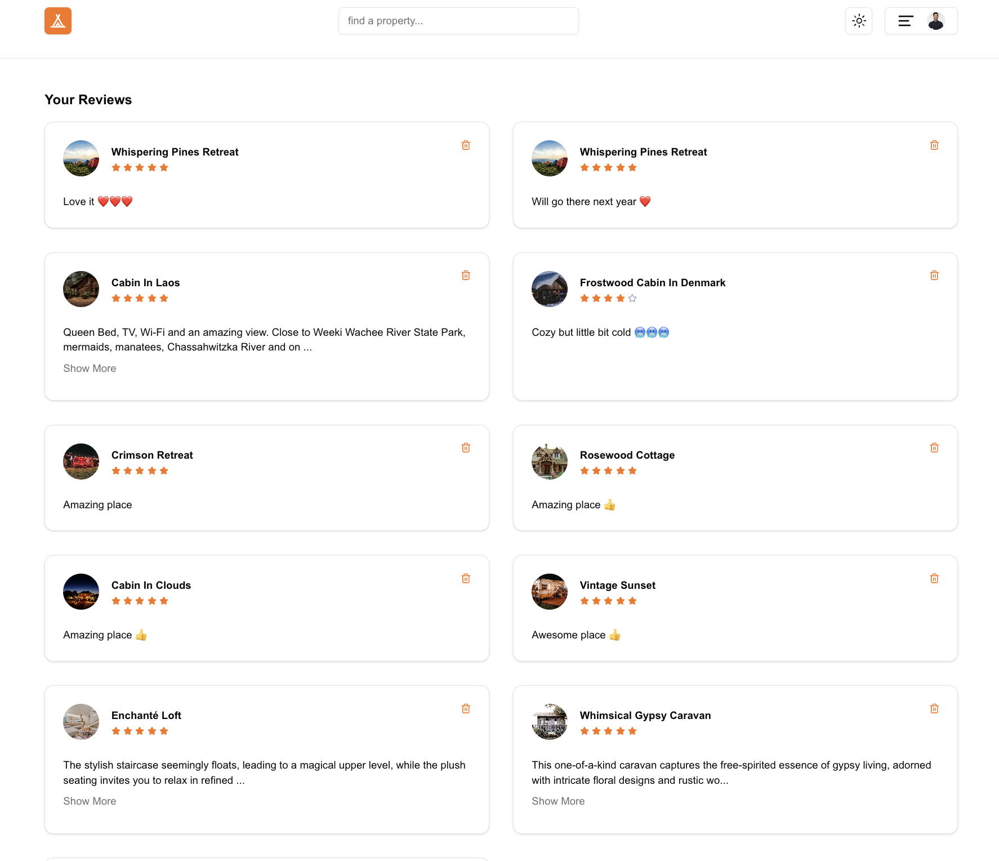
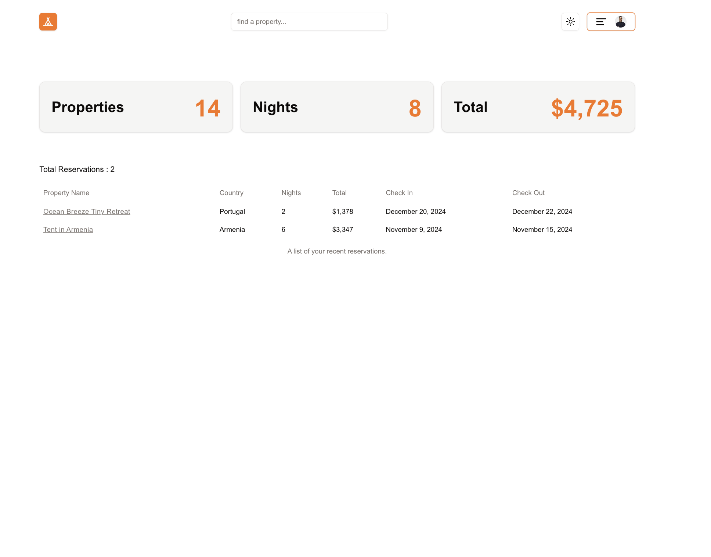
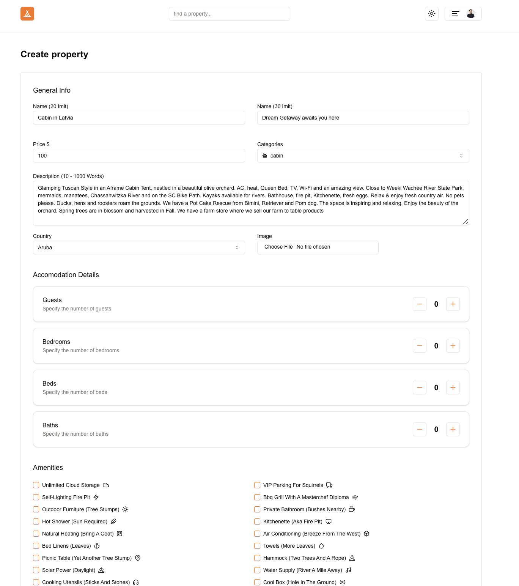
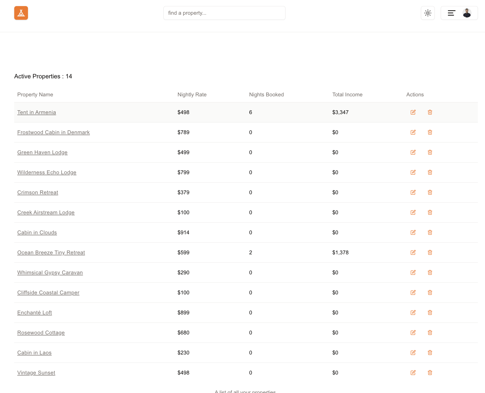
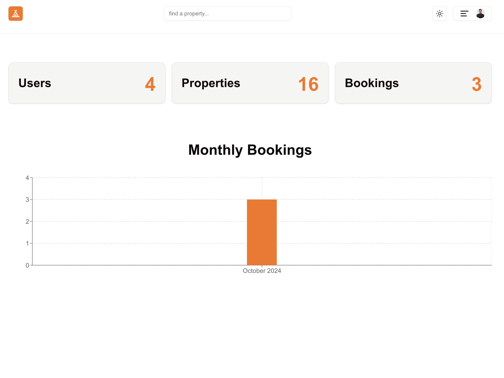
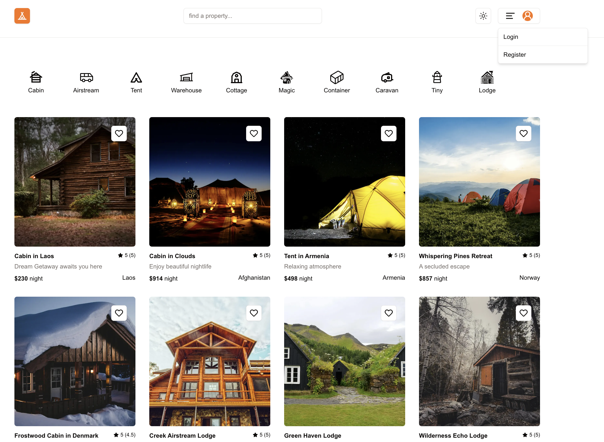

## TRIP-UZ

### Next App with Next.js 14+, Typescript, Clerk Auth, Prisma, Supabase, Tailwind, Shadcn-ui, Zod,Vercel and etc

| #   | Project                           | Description                                                                       |
| --- | --------------------------------- | --------------------------------------------------------------------------------- |
| 01  | [**Home**](#home)                 | The main landing page where users can browse available properties.                |
| 02  | [**Favorites**](#favorites)       | A personalized page showing all properties that the user has marked as favorites  |
| 03  | [**Bookings**](#bookings)         | A page displaying all of the user’s current and past bookings                     |
| 04  | [**Reviews**](#reviews)           | A section where users can see reviews they've given or received for properties.   |
| 05  | [**Reservations**](#reservations) | A page for property owners to manage reservations made on their listed properties |
| 06  | [**Create Rental**](#rentals)     | A form-based page where owners can add new rental properties to the platform      |
| 07  | [**My Rentals**](#myrentals)      | A dashboard for property owners to see and manage their listed rentals            |
| 08  | [**Admin**](#admin)               | Platform analytics, user management, and an overview of the system’s statistics.  |
| 09  | [**Login/Register**](#login)      | A simple action to log out the current user from the application using Clerk Auth |

## Keep in Touch

Check out our [**LinkedIn Page**](https://www.linkedin.com/in/anvarbekziyodov/) for more information about web development. Find tips, tricks, and motivational content to keep you engaged and motivated throughout your learning process.

## Share Your Insights

If you have any questions or feedback related to this project, feel free to [**Contact Us Here**](t.me/Anvarbek_Ziyodov).

## ABOUT

TRIP-UZ app uses Next.js 14+ for creating a fast and responsive user interface, combined with TypeScript for type safety. Styling is handled with TailwindCSS and Shadcn-ui for a consistent and visually appealing design. User authentication is managed through Clerk, while data storage and management are powered by Supabase and Prisma for database integration. The Zod library ensures data validation across forms, enhancing data integrity. The app supports image uploads, responsive layouts, and dynamic routing. Finally, the entire application is deployed on Vercel, providing a scalable and robust hosting environment.

##  1) Home

A social networking site using Next.js, MongoDB and Firebase.

[See Demo deployed on Vercel](https://trip-uz.vercel.app/)

[See home Component ](/app)

    

### Features

- Implemented file-based routing to define the home path.
- Created a general layout using reusable components.
- Displayed property listings with dynamic filters such as location, price, and amenities.
- Used Static Site Generation (SSG) for pre-rendering data to improve performance.
- Optimized images using Next.js Image component for better loading times.
- Added metadata to enhance SEO using the Head component.

##  2) Favorites

A personalized page showing all properties that the user has marked as favorites. It allows quick access to preferred rentals.

[See Favorites Component ](/app/favorites)

    

### Features

- Managed state for displaying favorite properties using client-side data fetching.
- Added functionality to toggle favorites using API routes.
- Implemented responsive layout to ensure compatibility across devices.
- Used server-side filtering to retrieve the user's favorite properties.
- Integrated local storage to persist favorite items.

##  3) Bookings

A page displaying all of the user’s current and past bookings. Users can manage their reservations, view booking details, and cancel if needed.

[See Bookings Component ](/app/bookings)

    

### Features

- Created a bookings dashboard to display user's past and future bookings.
- Used Server-Side Rendering (SSR) to fetch booking details from the database.
- Enabled booking cancellation and modification through API routes.
- Implemented status updates to track the booking’s confirmation and cancellation.
- Added error handling and user notifications for booking-related actions.

##  4) Reviews

A section where users can see reviews they've given or received for properties. It includes functionalities for submitting new reviews and rating properties.

[See Reviews Component ](/app/reviews)

    

### Features

- Allowed users to view and submit reviews for properties.
- Integrated a rating system with user input validation using the Zod library.
- Fetched and displayed reviews using client-side data fetching (SWR).
- Added pagination for handling multiple reviews dynamically.
- Ensured data integrity with form validation and user feedback.

##  5) Reservations

A page for property owners to manage reservations made on their listed properties. Owners can view booking details, approve or decline requests, and manage booking dates.

[See Reservations Component ](/app/reservations)

    

### Features

- Displayed reservations for property owners, fetched using server-side data.
- Implemented CRUD operations to manage bookings directly from the owner's dashboard.
- Utilized protected routes to ensure only property owners access this page.
- Set up a calendar component to visualize booking dates and availability.
- Added support for blocking dates to prevent double bookings.

##  6) Rentals

A form-based page where property owners can add new rental properties to the platform. It includes fields for property details, photos, pricing, and amenities.

[See Rentals Component ](/app/rentals)

    

### Features

- Developed a form-based interface for property owners to create new listings.
- Implemented image upload functionality using Supabase storage.
- Integrated form validation with Zod to ensure correct data submission.
- Used server actions to handle form data and store it in the database.
- Added categories and amenities inputs to customize each rental’s details.
- [caching posts](https://medium.com/@matswainson/building-a-search-component-for-your-next-js-markdown-blog-9e75e0e7d210) on each commit with Husky.

##  7) My Rentals

A dashboard for property owners to see and manage their listed rentals. Owners can update property information, view booking statuses, and edit availability.

[See Admin Component ](/app/rentals)

    

### Features

- Set up a dashboard for property owners to manage their current listings.
- Implemented edit and delete functionalities using API routes.
- Fetched user-specific data with server-side queries.
- Enabled real-time updates for property availability.
- Provided filtering options to view rentals based on booking status.

##  8) Admin

An admin page restricted to users with administrative rights. It provides access to platform analytics, user management, and an overview of the system’s statistics.

[See Rentals Component ](/app/admin)

    

### Features

- Created a protected admin panel accessible only to authorized users.
- Set up a statistics overview with data visualization using chart components.
- Integrated middleware for route protection based on user roles.
- Fetched site-wide data for review, booking, and property stats.
- Managed user accounts and roles directly from the admin page.

##  9) Login/Register

A simple action to log out the current user from the application, ensuring the session is terminated securely.

[See Rentals Component ](/app/rentals)

    

### Features

- Allowed users to view and update their profile information.
- Integrated Clerk for authentication and user management.
- Enabled image uploads for profile pictures with client-side previews.
- Used server actions to update user data in real time.
- Included user preferences and settings management.

## Acknowledgments

Reference for the technologies used in the application::

- [Next.js 14+](https://nextjs.org/) - Official Next.js documentation.
- [TypeScript](https://www.typescriptlang.org/) - Official TypeScript website.
- [TailwindCSS](https://tailwindcss.com/) - Official TailwindCSS documentation.
- [Shadcn-ui](https://ui.shadcn.dev/) - Official Shadcn-ui documentation.
- [Clerk](https://clerk.dev/) - Official Clerk authentication platform.
- [Supabase](https://supabase.com/) - Official Supabase documentation.
- [Prisma](https://www.prisma.io/) - Official Prisma documentation.
- [Zod](https://zod.dev/) - Official Zod validation library.
- [Stripe](https://stripe.com/) - Official Stripe payment platform.
- [Vercel](https://vercel.com/) - Official Vercel deployment platform.

## Show Your Support

If you find these projects helpful or interesting, please consider starring the repository. It's a simple gesture that helps to boost the visibility of the project and show appreciation for the effort put into creating it.
